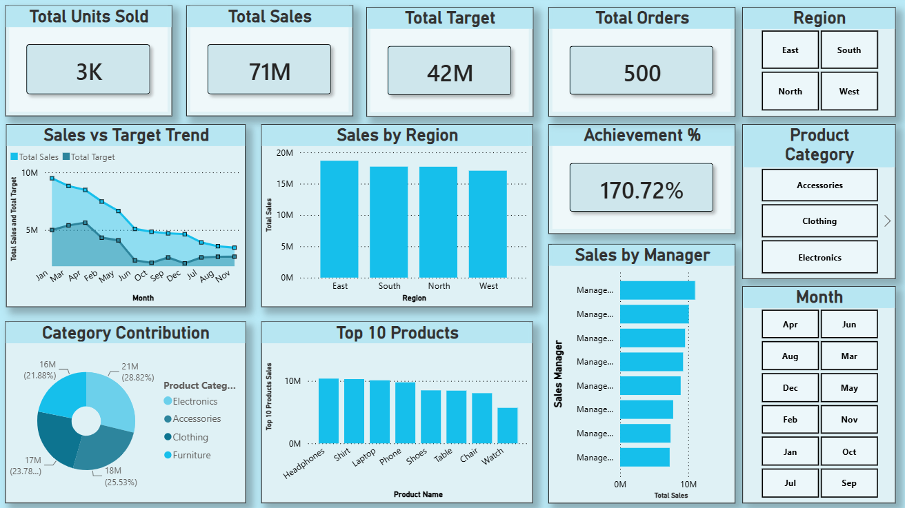

# Sales & Target Performance Dashboard

A Power BI dashboard analyzing sales performance against targets across regions, product categories, managers, and products — built to identify achievement gaps and top-performing segments.

## Overview

This dashboard tracks total sales, target achievement, and order volume across a fiscal year, with drill-down views by region, sales manager, product category, and individual product. It uses interactive slicers (Region, Product Category, Month) for dynamic filtering.

## Dashboard Preview

## Key Metrics (KPIs)

- **Total Sales** — 71M
- **Total Target** — 42M
- **Total Orders** — 500
- **Achievement %** — 170.72%
- **Units Sold** — 3K

## Visuals

| Visual | Description |
|---|---|
| Sales vs Target Trend | Monthly line/area chart comparing actual sales against target |
| Sales by Region | Column chart of total sales across East, South, North, West |
| Sales by Manager | Horizontal bar chart ranking managers by total sales |
| Category Contribution | Donut chart showing sales share by product category |
| Top 10 Products | Column chart of best-selling products by sales value |

## Interactivity

- Slicers for **Region**, **Product Category**, and **Month** allow cross-filtering across all visuals
- Fully interactive — selecting any slicer or chart element filters the rest of the dashboard

## Tools Used

- **Power BI Desktop** — data modeling, DAX measures, visualization
- **DAX** — custom measures for Achievement %, Top 10 Products ranking, and aggregations

## Data Model

Single fact table (`Data`) with columns for Date, Region, Sales Manager, Product Category, Product Name, Sales Amount, Target Sales, Units Sold, and related dimensions.

## Author

**Pothi Raja**
B.Com Fintech with AI, AMET University, Chennai
